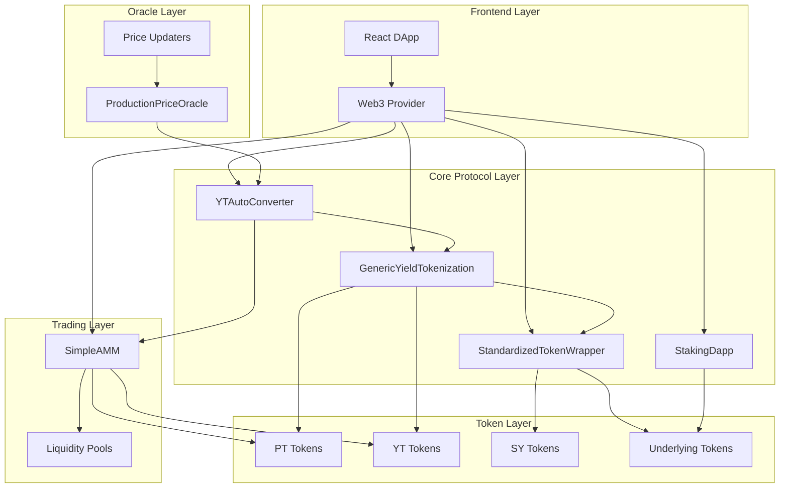
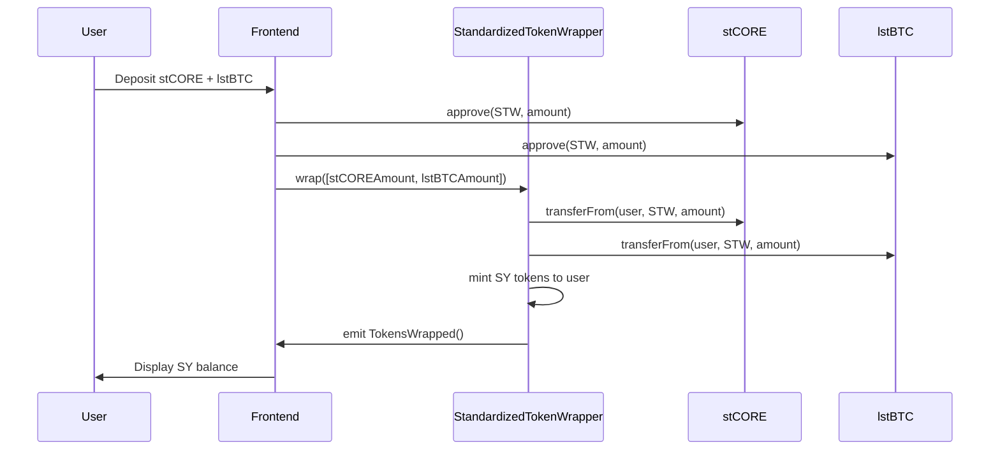
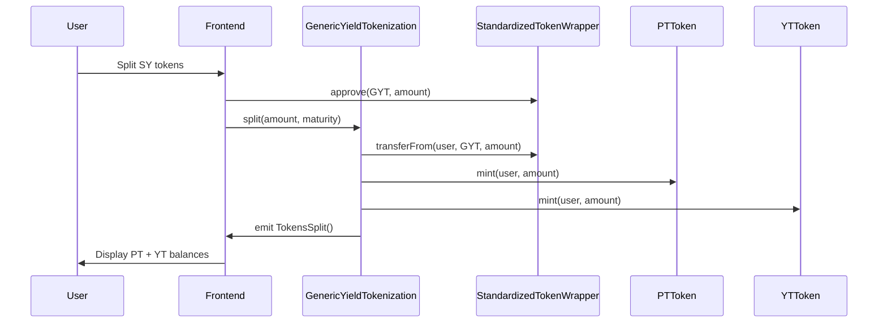
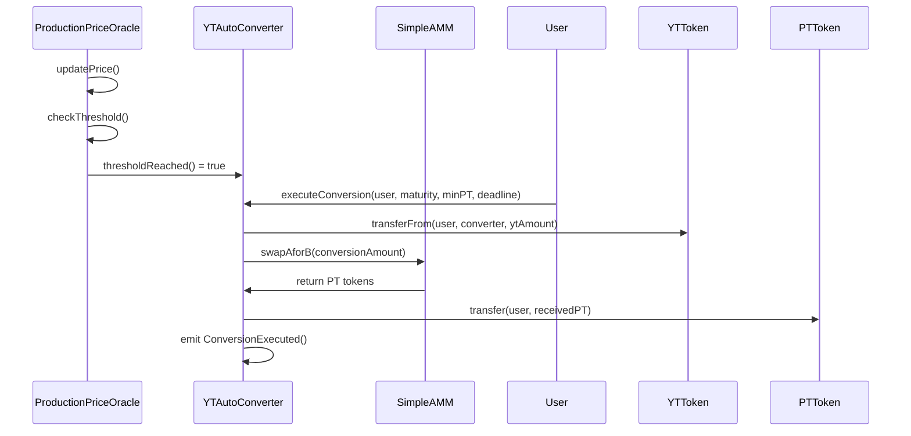
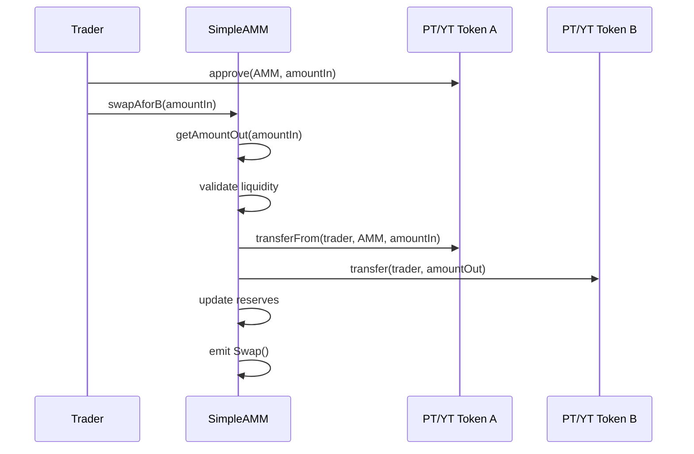
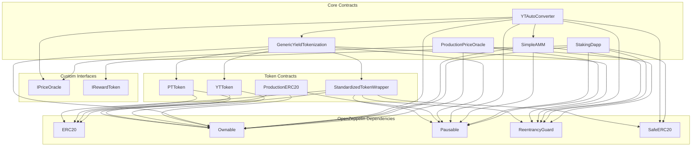
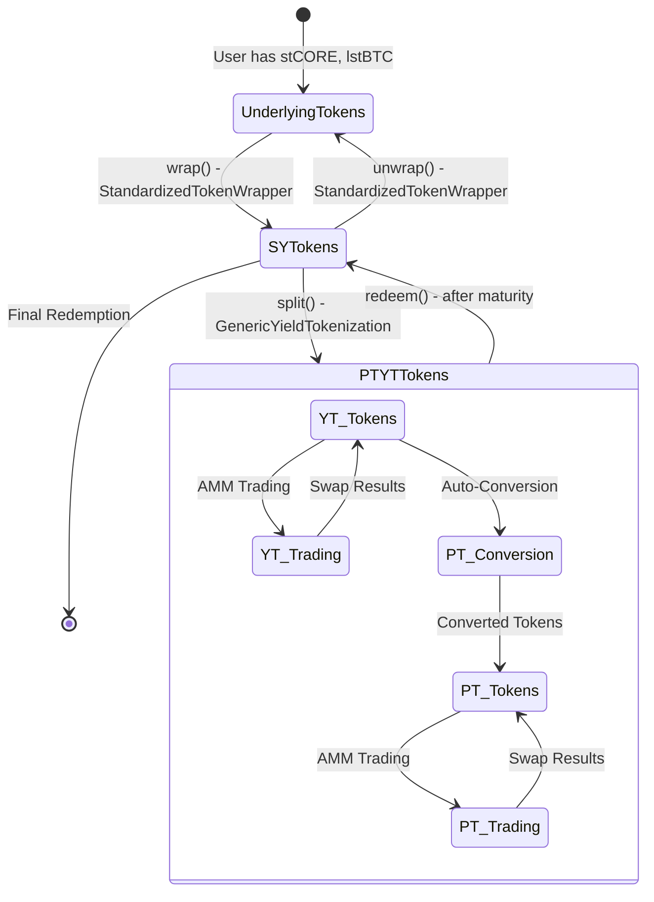
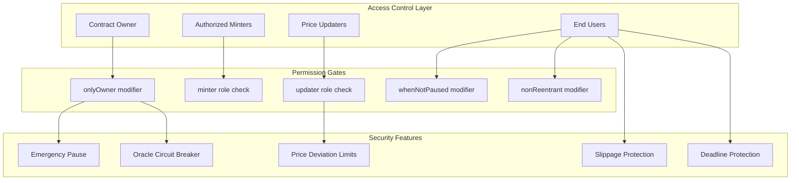
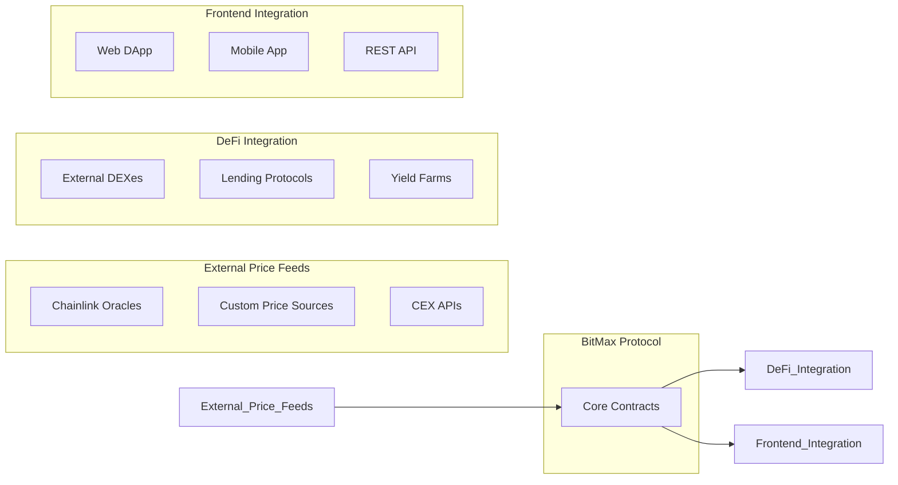

# BitMax Staking App - Architecture Documentation

## 🏗️ System Architecture

### High-Level Architecture Diagram



## 🔄 Contract Interaction Flow

### 1. Token Wrapping Flow



### 2. Yield Tokenization Flow



### 3. Auto-Conversion Flow



### 4. AMM Trading Flow



## 🔗 Contract Dependencies

### Dependency Graph



## 📊 Data Flow Architecture

### State Management Flow



### Event Flow Architecture

```mermaid
flowchart TD
    subgraph "Token Events"
        E1[TokensWrapped]
        E2[TokensUnwrapped]
        E3[TokensSplit]
        E4[TokensRedeemed]
        E5[TokenMinted]
        E6[TokenBurned]
    end
    
    subgraph "Trading Events"
        E7[Swap]
        E8[LiquidityAdded]
        E9[FeeUpdated]
    end
    
    subgraph "Conversion Events"
        E10[ConversionExecuted]
        E11[UserConfigUpdated]
        E12[ThresholdReached]
    end
    
    subgraph "Oracle Events"
        E13[PriceUpdated]
        E14[ThresholdSet]
        E15[CircuitBreakerTriggered]
    end
    
    subgraph "Staking Events"
        E16[Staked]
        E17[Unstaked]
        E18[RewardClaimed]
    end
    
    subgraph "Admin Events"
        E19[ContractPaused]
        E20[ContractUnpaused]
        E21[MinterAdded]
        E22[EmergencyWithdrawal]
    end
    
    Frontend[Frontend DApp] --> |Listen| E1
    Frontend --> |Listen| E2
    Frontend --> |Listen| E3
    Frontend --> |Listen| E4
    Frontend --> |Listen| E7
    Frontend --> |Listen| E10
    Frontend --> |Listen| E16
    
    Backend[Backend Services] --> |Monitor| E13
    Backend --> |Monitor| E15
    Backend --> |Monitor| E22
    
    Analytics[Analytics Service] --> |Track| E7
    Analytics --> |Track| E8
    Analytics --> |Track| E10
```



## 🔧 Component Architecture

### Smart Contract Components

```mermaid
classDiagram
    class StandardizedTokenWrapper {
        +TokenConfig[] tokens
        +uint256 tokenCount
        +uint256 yieldRateBps
        +wrap(amounts)
        +unwrap(amount)
        +configureToken(index, token, ratio, enabled)
    }
    
    class GenericYieldTokenization {
        +StandardizedTokenWrapper syToken
        +mapping ptTokens
        +mapping ytTokens
        +uint256[] maturities
        +createMaturity(maturity)
        +split(amount, maturity)
        +redeem(amount, maturity)
    }
    
    class YTAutoConverter {
        +IPriceOracle oracle
        +GenericYieldTokenization tokenization
        +SimpleAMM amm
        +uint256 conversionFee
        +mapping userConfigs
        +executeConversion(user, maturity, minPT, deadline)
        +configure(enabled, thresholdPrice)
    }
    
    class SimpleAMM {
        +IERC20 tokenA
        +IERC20 tokenB
        +uint256 reserveA
        +uint256 reserveB
        +uint256 fee
        +addLiquidity(amountA, amountB)
        +swapAforB(amountIn)
        +getAmountOut(amountIn, reserveIn, reserveOut)
    }
    
    class ProductionPriceOracle {
        +mapping prices
        +mapping thresholds
        +mapping priceUpdaters
        +bool circuitBreakerActive
        +updatePrice(token, price, confidence)
        +setThreshold(token, threshold)
        +getPrice(token)
    }
    
    StandardizedTokenWrapper ||--o{ GenericYieldTokenization : uses
    GenericYieldTokenization ||--o{ YTAutoConverter : uses
    SimpleAMM ||--o{ YTAutoConverter : uses
    ProductionPriceOracle ||--o{ YTAutoConverter : uses
```

### Security Architecture



## 🎯 Integration Points

### External System Integration



---

This architecture documentation provides a comprehensive view of how all components interact within the BitMax Staking App ecosystem. Each diagram illustrates different aspects of the system to help developers understand the complete picture.