# Contract Interaction Flowcharts

## 🔄 Complete System Flow Documentation

This document provides detailed flowcharts for all major user journeys and system interactions in the BitMax Staking App protocol.

---

## 🌊 User Journey Flowcharts

### 1. Complete User Journey: From Tokens to Yield

```mermaid
flowchart TD
    A[User has stCORE + lstBTC] --> B{Want to earn yield?}
    B -->|Yes| C[Wrap tokens into SY]
    B -->|No| Z[Keep original tokens]
    
    C --> D[Approve stCORE + lstBTC]
    D --> E[Call wrapper.wrap()]
    E --> F[Receive SY tokens]
    
    F --> G{Split for yield trading?}
    G -->|Yes| H[Split SY into PT + YT]
    G -->|No| I[Stake SY for rewards]
    
    H --> J[Approve SY tokens]
    J --> K[Call tokenization.split()]
    K --> L[Receive PT + YT tokens]
    
    L --> M{What to do with PT/YT?}
    M -->|Trade| N[Use AMM to trade]
    M -->|Hold YT| O[Set up auto-conversion]
    M -->|Hold PT| P[Wait for maturity]
    
    N --> Q[Add liquidity or swap]
    O --> R[Configure conversion threshold]
    P --> S[Redeem PT for SY at maturity]
    
    I --> T[Earn time-based rewards]
    T --> U[Claim rewards]
    
    Q --> V[Earn trading fees]
    R --> W[Auto-convert when price hits threshold]
    S --> X[Unwrap SY back to original tokens]
    
    style A fill:#e1f5fe
    style C fill:#f3e5f5
    style H fill:#e8f5e8
    style N fill:#fff3e0
    style O fill:#fce4ec
```

### 2. Token Wrapping Flow

```mermaid
sequenceDiagram
    participant User
    participant Frontend
    participant stCORE
    participant lstBTC
    participant STW as StandardizedTokenWrapper
    
    Note over User, STW: Token Wrapping Process
    
    User->>Frontend: "I want to wrap 100 stCORE + 200 lstBTC"
    Frontend->>User: "Please approve token spending"
    
    User->>stCORE: approve(STW, 100e18)
    stCORE-->>User: ✅ Approved
    
    User->>lstBTC: approve(STW, 200e18)
    lstBTC-->>User: ✅ Approved
    
    Frontend->>STW: wrap([100e18, 200e18])
    
    Note over STW: Validate inputs & calculate amounts
    STW->>STW: amounts.length == tokenCount ✓
    STW->>STW: token[0].ratio = 50%, token[1].ratio = 50%
    STW->>STW: wrappedAmount = (100*50% + 200*50%) = 150
    
    STW->>stCORE: transferFrom(user, STW, 100e18)
    STW->>lstBTC: transferFrom(user, STW, 200e18)
    STW->>STW: _mint(user, 150e18)
    
    STW->>Frontend: emit TokensWrapped(user, [100e18, 200e18], 150e18)
    Frontend->>User: "✅ Successfully wrapped! You received 150 SY tokens"
```



### 3. Yield Tokenization Flow


---

## 🔄 System Interaction Flows

### 4. Auto-Conversion System Flow

```mermaid
flowchart TD
    A[Price Oracle Updates] --> B{Price Threshold Reached?}
    B -->|No| C[Continue Monitoring]
    B -->|Yes| D[Trigger Available for User]
    
    C --> A
    D --> E[User/Keeper Calls executeConversion]
    
    E --> F{Validation Checks}
    F --> G[User enabled conversion?]
    F --> H[Conversion not executed?]
    F --> I[Valid deadline?]
    F --> J[User has YT balance?]
    
    G -->|No| K[❌ Conversion not enabled]
    H -->|No| L[❌ Already executed]
    I -->|No| M[❌ Transaction expired]
    J -->|No| N[❌ No YT balance]
    
    G -->|Yes| O{All checks passed?}
    H -->|Yes| O
    I -->|Yes| O  
    J -->|Yes| O
    
    O -->|No| P[❌ Revert transaction]
    O -->|Yes| Q[Calculate Conversion Fee]
    
    Q --> R[Transfer YT from User]
    R --> S[Execute Market Swap via AMM]
    S --> T[Calculate Received PT Amount]
    T --> U{Meets Minimum Output?}
    
    U -->|No| V[❌ Slippage too high]
    U -->|Yes| W[Transfer PT to User]
    
    W --> X[Send Fee to Protocol]
    X --> Y[Mark Conversion Executed]
    Y --> Z[✅ Emit ConversionExecuted Event]
    
    style A fill:#e3f2fd
    style D fill:#f3e5f5
    style S fill:#e8f5e8
    style Z fill:#e8f5e8
    style K fill:#ffebee
    style L fill:#ffebee
    style M fill:#ffebee
    style N fill:#ffebee
    style P fill:#ffebee
    style V fill:#ffebee
```



### 5. AMM Trading Flow

```mermaid
sequenceDiagram
    participant Trader
    participant Frontend
    participant TokenA as PT Token
    participant AMM as SimpleAMM
    participant TokenB as YT Token
    
    Note over Trader, TokenB: AMM Swap Process
    
    Trader->>Frontend: "Swap 50 PT for YT tokens"
    Frontend->>AMM: getAmountOut(50e18, reserveA, reserveB)
    AMM-->>Frontend: expectedYT = 45.2e18
    
    Frontend->>Trader: "You'll receive ~45.2 YT (0.3% fee)"
    Trader->>Frontend: "Proceed with swap"
    
    Trader->>TokenA: approve(AMM, 50e18)
    TokenA-->>Trader: ✅ Approved
    
    Frontend->>AMM: swapAforB(50e18)
    
    Note over AMM: Validation & Calculation
    AMM->>AMM: amountIn > 0 ✓
    AMM->>AMM: contract not paused ✓
    AMM->>AMM: calculate amountOut with fee
    AMM->>AMM: amountOut <= reserveB ✓
    
    AMM->>TokenA: transferFrom(trader, AMM, 50e18)
    AMM->>TokenB: transfer(trader, 45.2e18)
    
    Note over AMM: Update Reserves
    AMM->>AMM: reserveA += 50e18
    AMM->>AMM: reserveB -= 45.2e18
    
    AMM->>Frontend: emit Swap(trader, 50e18, 45.2e18, true)
    Frontend->>Trader: "✅ Swap complete! Received 45.2 YT tokens"
```



### 6. Oracle Price Update Flow


---

## 🔐 Security & Emergency Flows

### 7. Emergency Pause Flow

```mermaid
flowchart TD
    A[Security Issue Detected] --> B[Admin Assessment]
    B --> C{Severity Level}
    
    C -->|Critical| D[Immediate Action Required]
    C -->|High| E[Planned Response]
    C -->|Medium| F[Monitor & Prepare]
    
    D --> G[Emergency Pause All Contracts]
    E --> H[Pause Affected Contracts]
    F --> I[Continue Normal Operations]
    
    G --> J[GenericYieldTokenization.pause()]
    G --> K[StandardizedTokenWrapper.pause()]
    G --> L[SimpleAMM.pause()]
    G --> M[YTAutoConverter.pause()]
    G --> N[StakingDapp.pause()]
    
    H --> O[Selective Contract Pause]
    
    J --> P[Block split/redeem operations]
    K --> Q[Block wrap/unwrap operations]
    L --> R[Block trading operations]
    M --> S[Block conversions]
    N --> T[Block staking operations]
    
    O --> U[Investigation & Fix Development]
    P --> U
    Q --> U
    R --> U
    S --> U
    T --> U
    
    U --> V[Deploy Fixes if Needed]
    V --> W[Test Fixes on Testnet]
    W --> X[Gradual System Recovery]
    
    X --> Y[Unpause Contracts Gradually]
    Y --> Z[Resume Normal Operations]
    
    style A fill:#ffebee
    style D fill:#ff5722
    style G fill:#ff9800
    style U fill:#2196f3
    style Z fill:#4caf50
```

### 8. Oracle Circuit Breaker Flow


---

## 📊 Data Flow Diagrams

### 9. Token State Transitions


### 10. Event Flow & Monitoring


---

## 🔄 Integration Patterns

### 11. Frontend Integration Flow


### 12. Backend Service Integration


---

This comprehensive flowchart documentation provides visual representations of all major system interactions, making it easier for developers to understand the complete protocol flow and integration patterns.